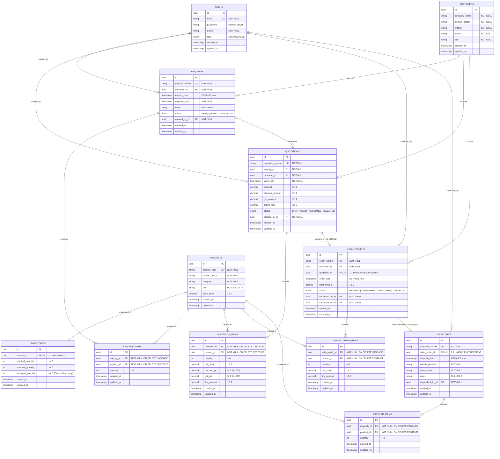

# Manufacturing ERP - Entity Relationship (ER) Diagram

## 1. Relational Entity Relationship Diagram (Mermaid)

---

## 2. Table-by-Table Data Dictionary

### Table: `users`
- Stores system operators with role-based access levels.
- `role`: Enum with values `'ADMIN'`, `'SALES'`.
- Passwords stored strictly as `bcrypt` hashes with cost factor 10+.

### Table: `customers`
- Master data for business clients.
- `company_name`, `contact_person`, `mobile`, `email`, `city`.

### Table: `products`
- Master catalog of industrial equipment items.
- `product_code`: Natural unique key (e.g., `"IND-BRG-001"`).
- `base_price`: Decimal representation to eliminate floating point issues.

### Table: `inventories`
- Maintains real-time physical, reserved, and damaged stock levels.
- Strictly 1:1 with `products` via `product_id` unique foreign key.
- $\text{Available} = \text{physical\_quantity} - \text{reserved\_quantity} - \text{damaged\_quantity}$.

### Table: `enquiries` & `enquiry_items`
- Represents formal incoming customer purchase enquiries.
- Relational line items link directly to `products` (no embedded JSON arrays).

### Table: `quotations` & `quotation_items`
- Relational commercial proposal generated against an enquiry.
- Independent authoritative financial calculations for subtotal, discount, GST, and grand total.

### Table: `sales_orders` & `sales_order_items`
- Converts accepted commercial offers into active sales contracts.
- **Race Condition Protection**: `quotation_id` carries a database-level unique constraint (`UNIQUE INDEX`), ensuring one quotation can NEVER yield two sales orders.

### Table: `dispatches` & `dispatch_items`
- Physical fulfillment record.
- **Race Condition Protection**: `sales_order_id` is unique, guaranteeing an order cannot be dispatched twice.
- Dispatch decreases both `physical_quantity` and `reserved_quantity` atomically.
